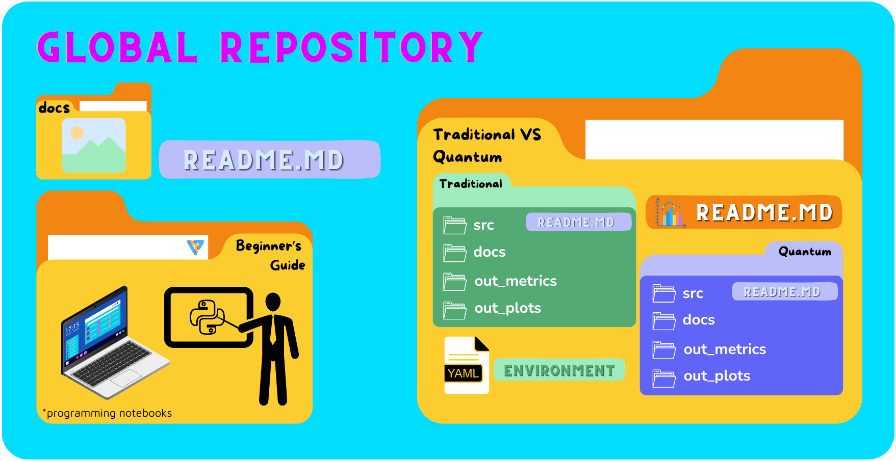

# Social Innovation - Energy Saving in Quantum Computing
Our project aims to find a preliminary answer to the general efficiency comparison of quantum com-
puting against traditional computing by evaluating the computation speed, the result accuracy and
the energy consumption among other equally important aspects. To deal with this comparison the
core of the Travelling Salesman Problem (TSP) has been coded and adapted for both quantum and
traditional paradigms. Other preliminary results indicate that quantum computing could lead to a
significant advantage in some specific problem domains with reduced computational complexity and
faster processing speeds. Further than that, our study explores the potential energy savings that
quantum systems can offer due to different operational principles. This research is looking forward
to highlight the practical benefits and limitations of the quantum computing paradigm and wants to
provide insights into future applications and integration with already existing technologies

## Repository structure
